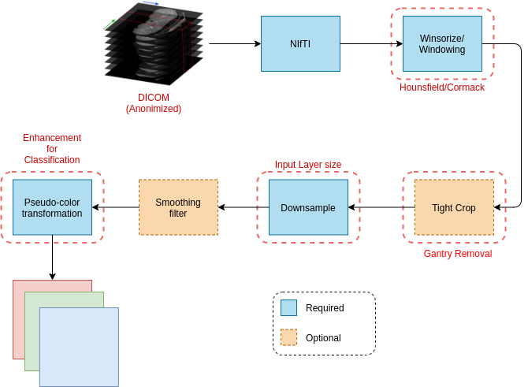

<!-- # img_proc -->
<h1>Medical Image Processing class</h1>

<figure>
  
</figure>

- Create the conda environment

```shell
(base):~$ conda env create -f environment.yml
```

<!-- ```shell
(amil_poc)$: python main.py \
                 --sample_path="images/imagem_teste.jpeg" \
                 --template_path="images/roi_teste.png"
``` -->
- Run img_proc container by running the folling command:

```shell
(base):~$ docker-compose up -d
```
